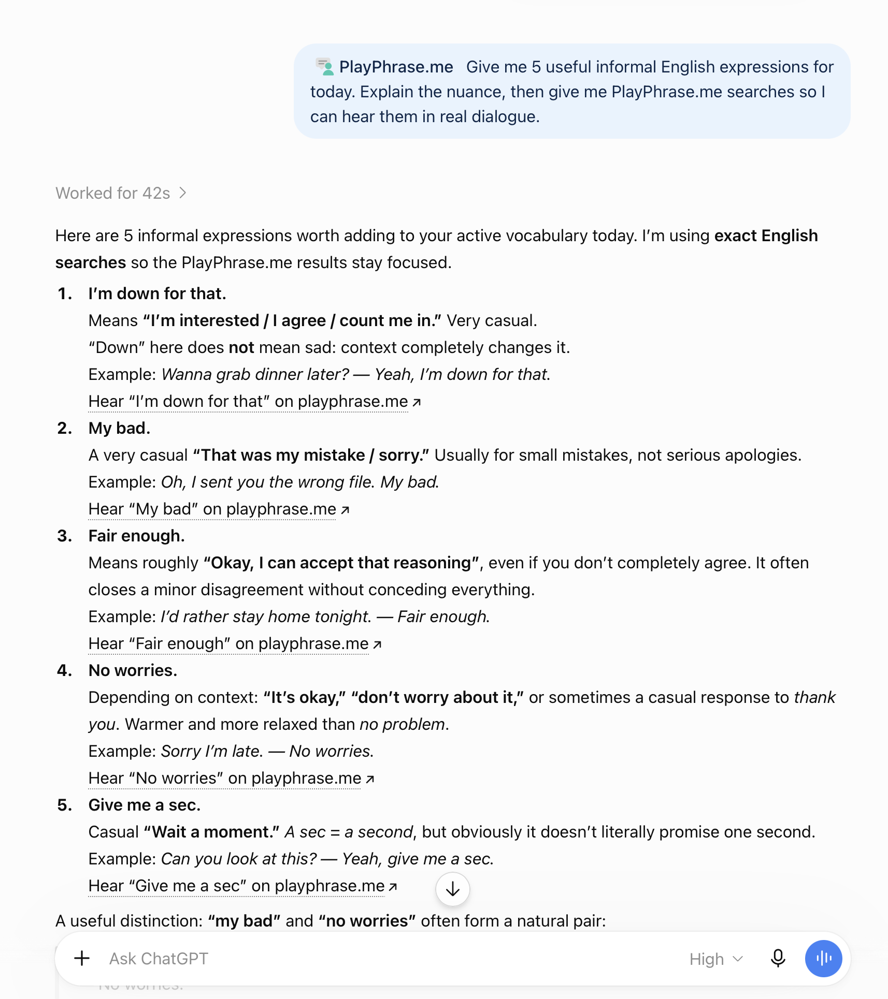
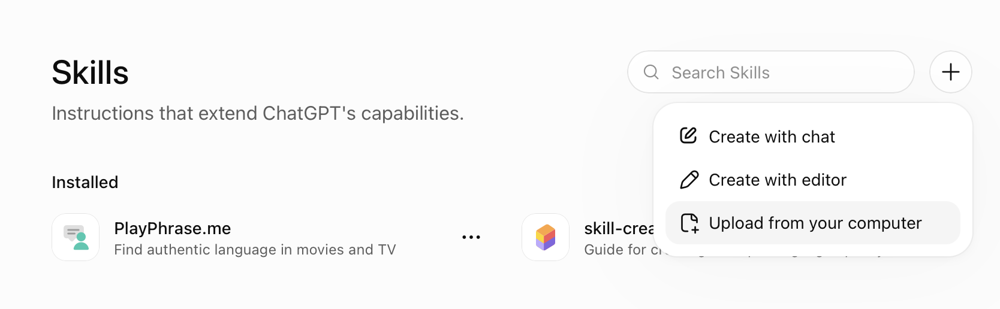

# Learn English with ChatGPT. Hear it in movies.

Ask ChatGPT about an expression you've heard, a message you want to get right,
or a conversation coming up tomorrow. With **PlayPhrase.me**, the answer comes
with links to hear the English in movie and TV dialogue.

Keep the conversation going: ask why a phrase works, try a different tone,
or find something that sounds more like you. Then open a listening link and
hear the words beyond the chat.

**[Get PlayPhrase.me for ChatGPT →](https://github.com/potapenko/playphraseme-skill/releases/latest/download/skill.zip)**

<p align="center">
  
  <br>
  <em>Ask a question in ChatGPT. Explore the expressions on PlayPhrase.me.</em>
</p>

## A question can turn into a conversation

For example:

**You:**

```text
How do I say “Ни за что не пропущу” in English?
```

**ChatGPT:**

```text
I wouldn't miss it for the world.

A warm, enthusiastic way to say you're determined to be there—at a friend's
wedding or a concert you're excited about.
```

**[“I wouldn't miss it for the world.” — listen on PlayPhrase.me →](https://www.playphrase.me/#/search?language=en&q=I+wouldn%27t+miss+it+for+the+world.)**

**You:**

```text
What does “for the world” mean here?
```

**ChatGPT:**

```text
It means nothing could persuade you to miss it. You're showing how much
being there matters to you.
```

You can start in your own language, ask a follow-up, or take the conversation
somewhere new. ChatGPT helps you understand the expression; PlayPhrase.me gives
you dialogue to listen to.

## What would you like to talk about?

**Something you've heard and want to understand**

```text
What does ‘cut me some slack’ mean? Would I say it to a friend or my boss?
```

**Something you want to say more naturally**

```text
Help me politely say no. A little softer. Now make it work in an email.
```

**Something you're preparing for**

```text
I have a job interview tomorrow. Help me talk about my experience.
```

**Something you haven't learned yet**

```text
Give me five useful B2 idioms. I already know the first one—show me another.
```

Ask for a quick explanation, spend time comparing expressions, or request a
lesson and practise together. You choose where the conversation goes.

## Start your first conversation

**[Download the PlayPhrase.me skill](https://github.com/potapenko/playphraseme-skill/releases/latest/download/skill.zip)**,
then add it to ChatGPT. Keep `skill.zip` zipped.

1. Open [ChatGPT Skills](https://chatgpt.com/skills).
2. Choose **+**, then **Upload from your computer**.
3. Upload `skill.zip`.

<p align="center">
  
</p>

Start a new chat, select `@PlayPhrase.me`, and ask something you've been wanting
to say. Or try this:

```text
@PlayPhrase.me How do I politely say no?
```

## Made by PlayPhrase.me

I build [PlayPhrase.me](https://www.playphrase.me/), where you can explore
language through movie and TV dialogue. I made this skill to bring that
experience into your conversations with ChatGPT.

**[Try PlayPhrase.me in ChatGPT →](https://github.com/potapenko/playphraseme-skill/releases/latest/download/skill.zip)**

<details>
<summary><strong>Install in Codex, Claude, or another agent</strong></summary>

Paste this prompt into the agent:

```text
Install the PlayPhrase.me skill from:
https://github.com/potapenko/playphraseme-skill/tree/master/skills/playphraseme

When it is ready, tell me how to use it here. If this app cannot install skills
directly, give me the simplest steps for adding it.
```

</details>
